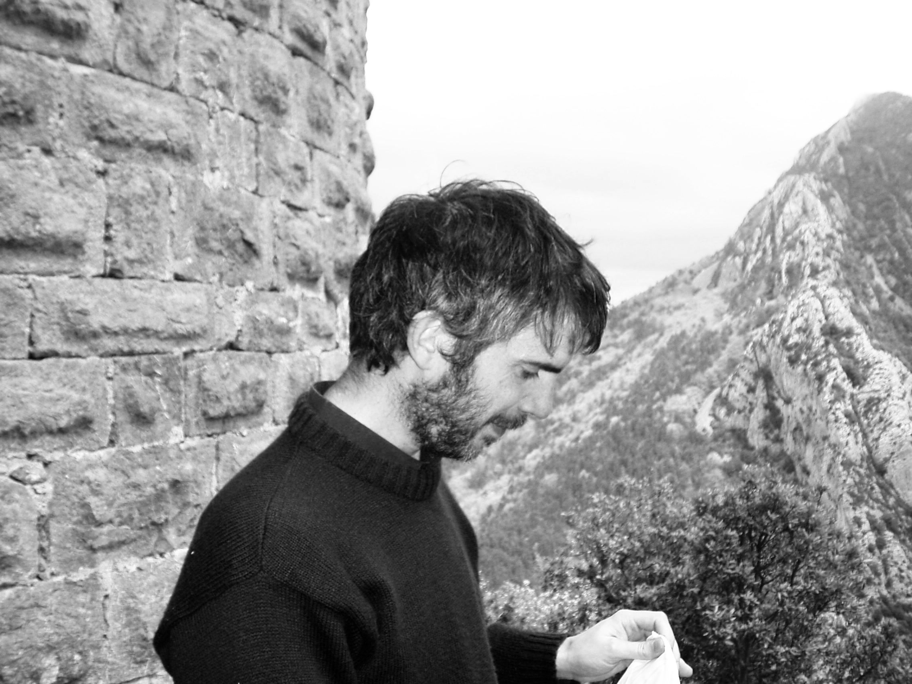

# Andres Legarra

[comment]: # ( )

Since 2023 I am Senior Geneticist for [CDCB](https://uscdcb.com) working in genetic evaluation os US dairy cattle. I am also Adjunct (which means no salary and no major duties) Assistant Professor in Animal Genetics and Genomics, University of Georgia.

 My work is related to quantitative genetics and genetic evaluation of livestock. E-mail me at andres dot legarra at uscdcb dot com .

I did my PhD in [Neiker](http://www.neiker.net/?lang=en) with [Eva Ugarte](http://www.neiker.net/ia/produccion-animal/lineas-investigacion-pa/?lang=en)  and I did a postdoc at the Animal and Dairy Science Department at the University of Georgia, with [Ignacy Misztal and Keith Bertrand](http://nce.ads.uga.edu). For 17 years I have been Research Director at [INRA Toulouse](http://www.toulouse.inra.fr/en) in the [GenPhySE](http://genphyse.toulouse.inra.fr) unit, at the [Animal Genetics](www.ga.inra.fr/en) department. I am now on unpaid leave.

This is my new, non-fancy web page created with [markdown](https://en.wikipedia.org/wiki/Markdown) and [MacDown](http://macdown.uranusjr.com) then with the (sadly dead) [atom](https://github.com/atom/atom) and now [Visual Studio Code](https://code.visualstudio.com). I should use [vim](https://www.vim.org/) which is immuable.

You can find in this page links to

* My [**blog**](http://artadia.blogspot.com) with Geekeries and Genetics
* My [Orcid](http://orcid.org/0000-0001-8893-7620),
[Google Scholar](https://scholar.google.fr/citations?user=oMML1K4AAAAJ&hl=en),
[Researcher ID](http://www.researcherid.com/rid/G-9451-2012),
[Researchgate](https://www.researchgate.net/profile/Andres_Legarra),
[PubMed](http://www.ncbi.nlm.nih.gov/pubmed?term=Legarra%20A%5BAuthor%5D) and
[ProdINRA](http://prodinra.inra.fr/au/alegarraalb)  profiles
* My [**github**](https://github.com/alegarra/) 

## Software
 I have developed my own programs

- for genomic prediction [GS3 in Github](https://github.com/alegarra/gs3) and [GS3 in Genotoul](http://genoweb.toulouse.inra.fr/~alegarra/gs3_folder), with several executable files. GS3 was partially financed by [Genomia](http://www.genomia.net), which was financed by [Poctefa](https://www.poctefa.eu).
- for variance components in multiple trait threshold models [TM](http://genoweb.toulouse.inra.fr/~alegarra/tm_folder)

and helped in others' people programs:

- I participate actively in developing the **blupf90 family**, which now has a [wiki](http://nce.ads.uga.edu/wiki/doku.php?id=start) and [handbook](http://nce.ads.uga.edu/wiki/lib/exe/fetch.php?media=blupf90_all4.pdf) and whose binaries are [here](http://nce.ads.uga.edu/html/projects/programs/).
- I have helped a little in developing
	- QTL detection software [QTLMap](https://github.com/ofilangi/qtlmap)
	- QTL detection software [QxPak](https://www.icrea.cat/en/Web/ScientificStaff/menciso/more#researcher-nav)
	- Simulation software [ms2gs](https://github.com/mperezenciso/ms2gs)

## Reviewing

- I am Senior Editor (Breeding, Genetics, and Genomics) of [Journal of Dairy Science](http://www.journalofdairyscience.org)
- ...and Associate Editor of [Genetics Selection Evolution](https://gsejournal.biomedcentral.com)
- ...and I chat in [Acteon](http://acteon.webs.upv.es)

## Course on Genomic Selection

This is a course that is taught every two years at [UGA](http://nce.ads.uga.edu), with materials of the [2018 edition](http://nce.ads.uga.edu/wiki/doku.php?id=course_information_-_uga_2018) . I often teach a part of it. Some materials that we have constructed for this course include notes *Bases for Genomic Prediction* [in pdf](http://genoweb.toulouse.inra.fr/~alegarra/GSIP.pdf) , [in epub](http://genoweb.toulouse.inra.fr/~alegarra/GSIP.epub) , and [in single-file html](http://genoweb.toulouse.inra.fr/~alegarra/GSIP.html) (but without the Appendix) formats.

<!--* computer [exercises](http://genoweb.toulouse.inra.fr/~alegarra/lab_all.pdf)
* and [slides](http://genoweb.toulouse.inra.fr/~alegarra/slides_all.pdf)-->

## Other material

### Notes on Linear Models for Breeding Value prediction (in Spanish)

Fundamentos matematicos de la prediccion de valores de cria. Francisco Javier Mendizábal Múgica. 1994

Notas de la asignatura Mejora Genética Animal. Escuela Técnica Superior de Ingenieros Agrónomos, UPNA. Pamplona-Iruña, 1994. 

https://github.com/alegarra/Fundamentos/blob/main/capitulo_all.pdf 

### Genomia

In our [POCTEFA](https://www.poctefa.eu/) grant that what called Genomia, we wrote a document with the state of the art of dairy sheep selection across the Pyrenees. You can find it [here](http://genoweb.toulouse.inra.fr/~alegarra/genomia_all.pdf). 

### Metafounders

[Our paper in metafounders' theory](https://academic.oup.com/genetics/article/200/2/455/5936198#326396912)  contained source code that is lost from the new Genetics site. You cand found this source code [here](https://genoweb.toulouse.inra.fr/~alegarra/metafounders_code.tar.gz). 

I have written a tutorial, [here](http://genoweb.toulouse.inra.fr/~alegarra/ThreeWayDist/crosses_blupf90.pdf) on the use of metafounders to analyse crossbred data with the [blupf90 wiki](http://nce.ads.uga.edu/wiki/doku.php?id=start) suite using SSGBLUP. The tutorial is conceived for 3-way crosses but the ideas inside can be used (easily) for 2- or 4-way crosses or (a bit more difficult) for complex crosses like in sheep. This work has been financed by [Smarter](https://www.smarterproject.eu/).

### Method LR

Similarly, another tutorial  [here](http://genoweb.toulouse.inra.fr/~alegarra/SMARTER_D5.3_Use_of_method_LR.pdf) explains the use of method LR to analyze bias and accuracies of evaluation (including genomic prediction). This work has been financed by [Smarter](https://www.smarterproject.eu/).

### Quick notes for myself on Julia

Really [nothing very sophisticated](http://genoweb.toulouse.inra.fr/~alegarra/my_julia.html).

## Courses held at GenphySE, INRA

### Advanced Quantitative Genetics for Animal Breeding

Taught by [Miguel Angel Toro](https://scholar.google.es/citations?user=NBnXp5QAAAAJ&hl=en), Universidad Politecnica de Madrid at GenPhySE,
INRA Toulouse March 14-17, 2017. Slides are [here](http://genoweb.toulouse.inra.fr/~alegarra/slides_all_miguel_toro.pdf).

### Systems Biology and Gene Networks Inference: Application to Livestock Breeding and Genetics

Taught by [Toni Reverter](https://people.csiro.au/R/T/Toni-Reverter-Gomez.aspx), CSIRO Agriculture and Food, Brisbane, Australia at
GenPhySE, INRA Toulouse, Nov 19-23, 2018. All slides are [here](http://genoweb.toulouse.inra.fr/~alegarra/slides_all_toni_reverter.pdf).

## Some other documents

* My 2002 [PhD dissertation](http://genoweb.toulouse.inra.fr/~alegarra/tesis_andres_legarra.pdf) (in Spanish)
* My 2012 [HDR dissertation](http://genoweb.toulouse.inra.fr/~alegarra/final_al.pdf) (in French)

and, in English:

* a [short bio](http://genoweb.toulouse.inra.fr/~alegarra/short_bio.txt)
* a [1-paragraph CV](http://genoweb.toulouse.inra.fr/~alegarra/1%20paragraph%20CV.txt)
* a [longer CV](http://genoweb.toulouse.inra.fr/~alegarra/CV_english_long_v3.pdf), and
* a [list of publications](http://genoweb.toulouse.inra.fr/~alegarra/ANNEXES_2015.pdf).

